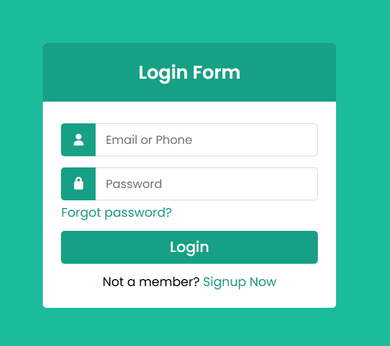

# Login Form Project

A clean and modern login form built with HTML and CSS featuring icon-enhanced input fields, smooth focus transitions, and an attractive turquoise color scheme.

## Features

- Email/Phone and Password input fields with icons (Font Awesome)
- Icon-enhanced input fields with user and lock icons on the left side
- Smooth focus transitions with border color and shadow effects
- "Forgot password?" link for password recovery
- "Signup Now" link for new user registration
- Responsive design with centered layout
- Modern UI with turquoise/teal color scheme (#16a085)
- Hover effects on links and submit button

## Demo

## Live Demo

You can view the live project here: [Live Demo Link](https://abhijitsinha-dev.github.io/html-css/login-form/#)

## Technologies Used

- HTML5
- CSS3 (Flexbox, Transitions)
- Font Awesome (for icons)
- Normalize.css (for cross-browser consistency)
- Google Fonts (Poppins)

## How to Use

1. Clone or download this repository/project folder.
2. Open `index.html` in your browser.
3. The form accepts email/phone and password inputs.
4. Modify the form action attribute in `index.html` to connect to your backend if needed.
5. Customize the placeholder text, form labels, or add validation as needed.

## Customization

- **Colors**: Change the color scheme by modifying `#16a085` and `#1abc9c` values in `style.css`.
- **Form Fields**: Add or remove input fields by copying the `.row` structure in `index.html`.
- **Icons**: Replace Font Awesome icon classes (`fa-user`, `fa-lock`) with your preferred icons.
- **Form Action**: Update the `action` attribute in the `<form>` tag to point to your login endpoint.
- **Fonts**: Modify the Poppins font import or change the font-family in `style.css`.
- **Layout**: Adjust the container width and margins in `.container` class for different sizes.

## Key CSS Techniques

- **Icon Positioning**: Uses `position: absolute` for icons inside relatively positioned `.row` containers
- **Input Padding**: Left padding (`padding-left: 60px`) creates space for icons on the left
- **Focus States**: Custom border color and inset box-shadow on input focus for visual feedback
- **Hover Effects**: Button and link hover states with color changes and text decoration
- **Smooth Transitions**: All interactive elements use `transition: all 0.3s ease` for smooth animations

## Related Projects/Navigation

- Return to the overall projects list: [Main Projects README](../README.md)
