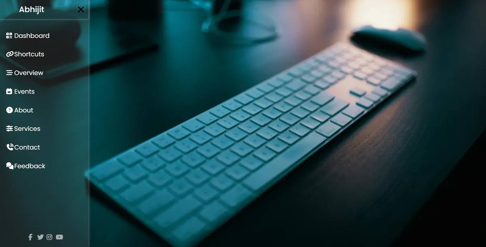

# Sidebar Project

A sleek and modern sliding sidebar menu built with HTML and CSS, featuring a pure CSS toggle mechanism, glassmorphism styling, smooth animations, and responsive design.

## Features

- **CSS-only toggle**: Uses a hidden checkbox and CSS `:checked` pseudo-class for JavaScript-free functionality
- Smooth slide-in/slide-out animation
- Glassmorphism design with semi-transparent background and subtle shadows
- Navigation menu with Font Awesome icons
- Hover effects on menu items with visual feedback
- Social media links at the bottom
- Responsive design with dynamic viewport height (`100dvh`)
- Background image support for aesthetic appeal

## Demo

_Note: The sidebar slides in from the left when the hamburger menu icon is clicked._

## Live Demo

You can view the live project here: [Live Demo Link](https://abhijitsinha-dev.github.io/html-css/sidebar/#)

## Technologies Used

- HTML5
- CSS3 (Flexbox, Transitions, CSS Selectors)
- Font Awesome (for icons)
- Normalize.css (for cross-browser consistency)
- Google Fonts (Poppins)

## How to Use

1. Clone or download this repository/project folder.
2. Open `index.html` in your browser.
3. Click the hamburger menu icon (☰) in the top-left corner to open the sidebar.
4. Click the X icon to close the sidebar.
5. Replace `keyboard-img.jpg` with your desired background image if needed.
6. Modify the HTML (logo name, menu items, social links, etc.) to fit your needs.

## Customization

- **Background**: Replace `keyboard-img.jpg` or modify the `background` property in `.main-box` class.
- **Colors**: Adjust the `rgba()` values for transparency and colors in `.sidebar-menu`.
- **Menu Items**: Add or remove menu items in the `<ul>` section of `index.html`.
- **Sidebar Width**: Change the `width` property in `.sidebar-menu` (currently `280px`).
- **Animation Speed**: Modify the `transition` duration (currently `0.3s`).
- **Icons**: Replace Font Awesome icon classes with your preferred icons.

## Key CSS Techniques

- **Toggle Mechanism**: Uses `#checkbox:checked ~ .sidebar-menu` selector to toggle sidebar visibility
- **Position Fixed**: Sidebar uses `position: fixed` to stay in viewport
- **Off-screen Positioning**: Sidebar is hidden using `left: -280px` and slides in with `left: 0`
- **Glassmorphism**: Achieved with `rgba(255, 255, 255, 0.1)` background and `box-shadow`
- **Smooth Transitions**: All animations use `transition: all 0.3s linear`

## Related Projects/Navigation

- Return to the overall projects list: [Main Projects README](../README.md)
