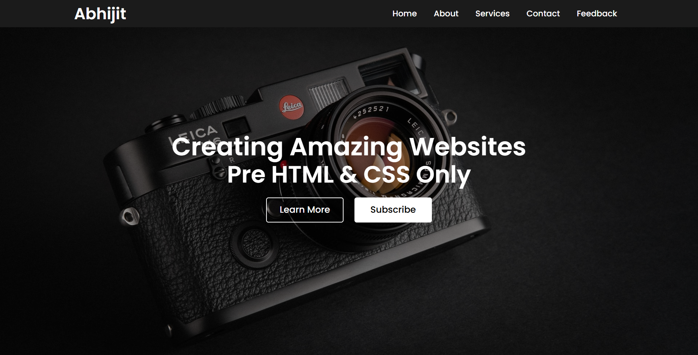

# Simple Website Project

A clean and modern landing page built with HTML and CSS featuring a fixed navigation bar, full-screen background image with overlay, centered hero content, and smooth hover animations.

## Features

- **Fixed navigation bar** with logo and menu items at the top
- Full-screen background image with dark overlay for better text readability
- Centered hero section with title, subtitle, and call-to-action buttons
- Smooth hover effects on navigation links and buttons
- Responsive design with dynamic viewport height (`100dvh`)
- Modern UI with Poppins font and clean styling
- Button variations (outlined and filled styles)

## Demo

## Live Demo

You can view the live project here: [Live Demo Link](https://abhijitsinha-dev.github.io/html-css/simple-website/#)

## Technologies Used

- HTML5
- CSS3 (Flexbox, Transitions, CSS Selectors)
- Normalize.css (for cross-browser consistency)
- Google Fonts (Poppins)

## How to Use

1. Clone or download this repository/project folder.
2. Open `index.html` in your browser.
3. Replace `website-bg.jpg` with your desired background image if needed.
4. Modify the HTML (logo name, menu items, title, subtitle, button text, etc.) to fit your needs.

## Customization

- **Background Image**: Replace `website-bg.jpg` or modify the `background` property in `.img` class.
- **Colors**: Adjust the navigation background color (`#1b1b1b`), overlay opacity (`rgba(0, 0, 0, 0.4)`), and text colors in `style.css`.
- **Menu Items**: Add or remove navigation items in the `<ul>` section of `index.html`.
- **Content**: Update the title, subtitle, and button text in the `.center-text` section.
- **Logo**: Change the logo text in the `.logo` section.
- **Font Sizes**: Modify font sizes for title (currently `55px`), subtitle (currently `52px`), and navigation links (currently `18px`).
- **Button Styles**: Adjust button dimensions, colors, and hover effects in `.center-text .btns button` styles.

## Key CSS Techniques

- **Fixed Navigation**: Uses `position: fixed` with `z-index: 100` to keep navigation bar at the top
- **Full-Screen Background**: Uses `100dvh` for full viewport height and `background-size: cover` for responsive image scaling
- **Overlay Effect**: Uses `::before` pseudo-element with `rgba(0, 0, 0, 0.4)` for dark overlay on background image
- **Centered Content**: Uses flexbox (`display: flex`, `justify-content: center`, `align-items: center`) for perfect centering
- **Absolute Positioning**: Hero content uses `position: absolute` to overlay on the background image
- **Smooth Transitions**: All interactive elements use `transition: all 300ms ease` for smooth hover animations
- **Button Variations**: First button uses outlined style (transparent background) that fills on hover

## Related Projects/Navigation

- Return to the overall projects list: [Main Projects README](../README.md)
